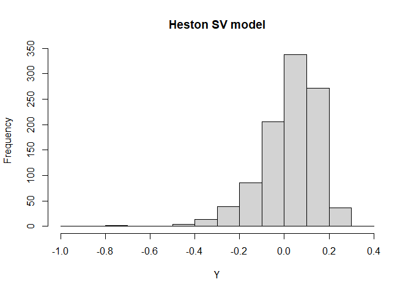

<!-- build with `devtools::build_readme()` -->
<!-- README.md is generated from README.Rmd. Please edit that file -->

# ajd.sim.kbf

<!-- badges: start -->
<!-- badges: end -->

The goal of `ajd.sim.kbf` is to **sim**ulate exactly the Heston
Stochastic Volatility (SV) model and its **A**ffine **J**ump
**D**iffusion (AJD) extensions using the
**K**yriakou-**B**rignone-**F**usai algorithm (Kyriakou-Brignone-Fusai,
2024), hence the name `ajd.sim.kbf`. The extended models include

- SVJ: SV model with jumps in the price process.

- SVCJ: SV model with contemporaneous jumps both in the price and
  variance processes.

*References*:

- Kyriakou, I., Brignone, R., & Fusai, G. (2024). Unified moment-based
  modeling of integrated stochastic processes. *Operations Research*,
  72(4), 1630-1653.

- Broadie, M., & Kaya, Ö. (2006). Exact simulation of stochastic
  volatility and other affine jump diffusion processes. *Operations
  Research*, 54(2), 217-231.

## Installation

You can install the development version of ajd.sim.kbf like so:

``` r
# library(devtools)
install_github("xmlongan/ajd.sim.kbf")
```

## Example

This is a basic example which shows you how to simulate some return (not
the price) samples of the Heston SV model and plot a histogram of these
simulated returns:

``` r
library(ajd.sim.kbf)
v0 = 0.010201; k = 6.21; theta = 0.019; sigma = 0.61; rho = -0.7
r = 0.0319; tau = 1
Y = ajd.sim.kbf::ryield_Hest(1000, v0, tau, r, k, theta, sigma, rho)
hist(Y, main="Heston SV model")
```



If you want to simulate samples from the other two SV models, use:

- `ryield_SVJ()` for SVJ model,

- `ryield_SVCJ()` for SVCJ model.

## Pricing the European call option Using Monte Carlo simulation

If your are interested in pricing the European call option using Monte
Carlo simulation for the Heston SV, SVJ and SVCJ models. Please refer to
functions `?price_Hest`, `?price_SVJ` and `?price_SVCJ`.
